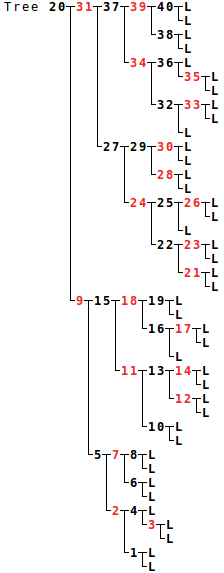
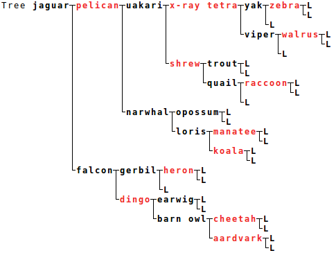

# branchy

A Java implementation of [red-black trees](https://en.wikipedia.org/wiki/Red%E2%80%93black_tree).

To build:

    $ ant build

To test:

    $ java -jar dist/lib/branchy-<date>.jar

# Examples

Integers:

Strings:

